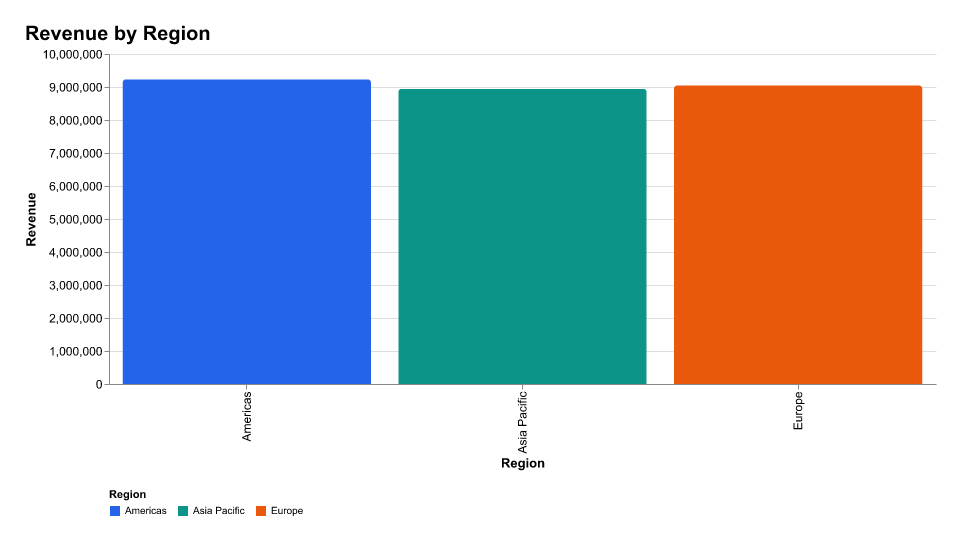
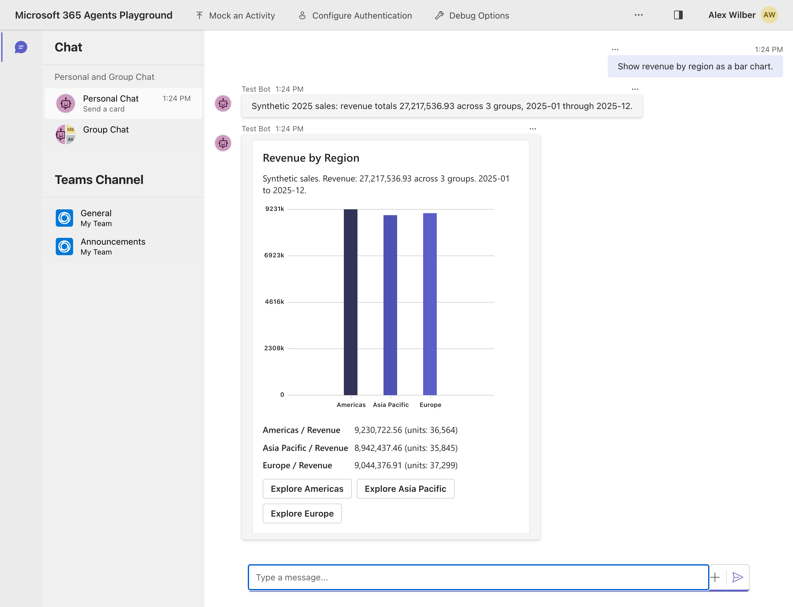
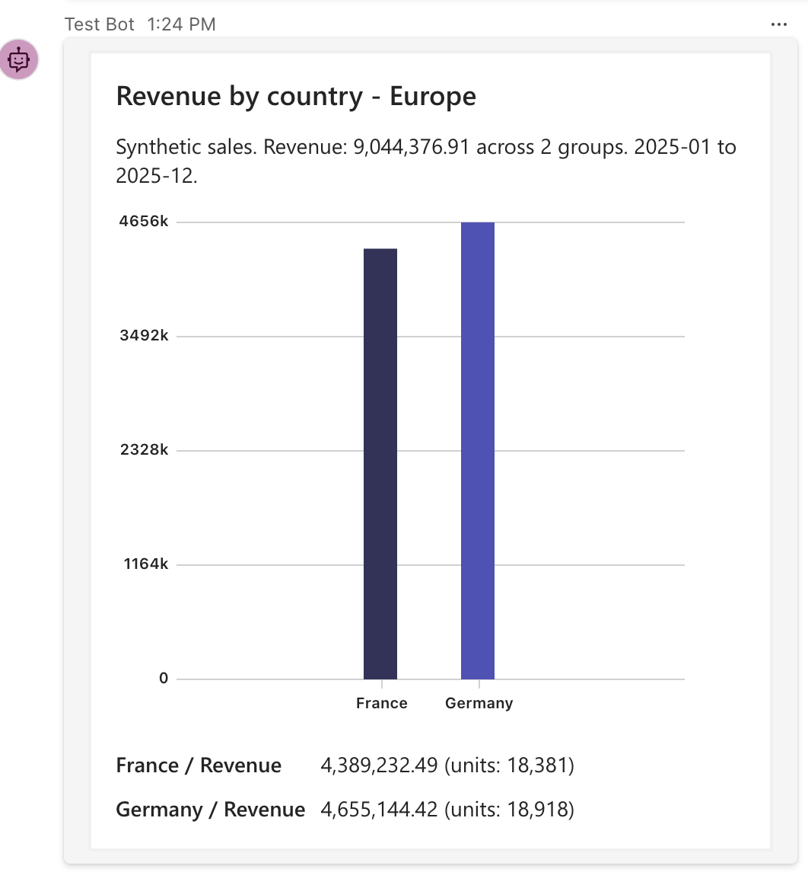
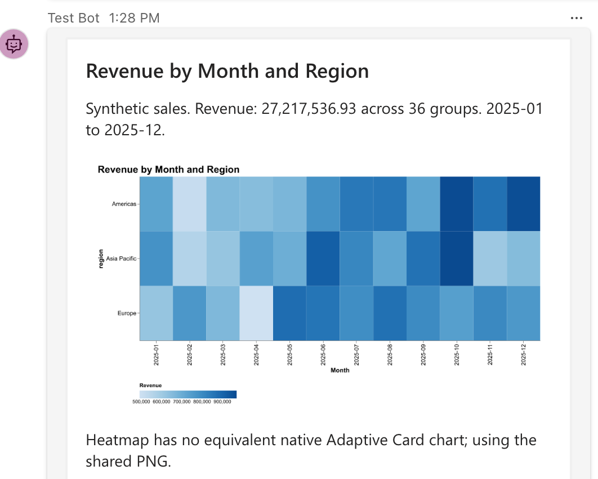
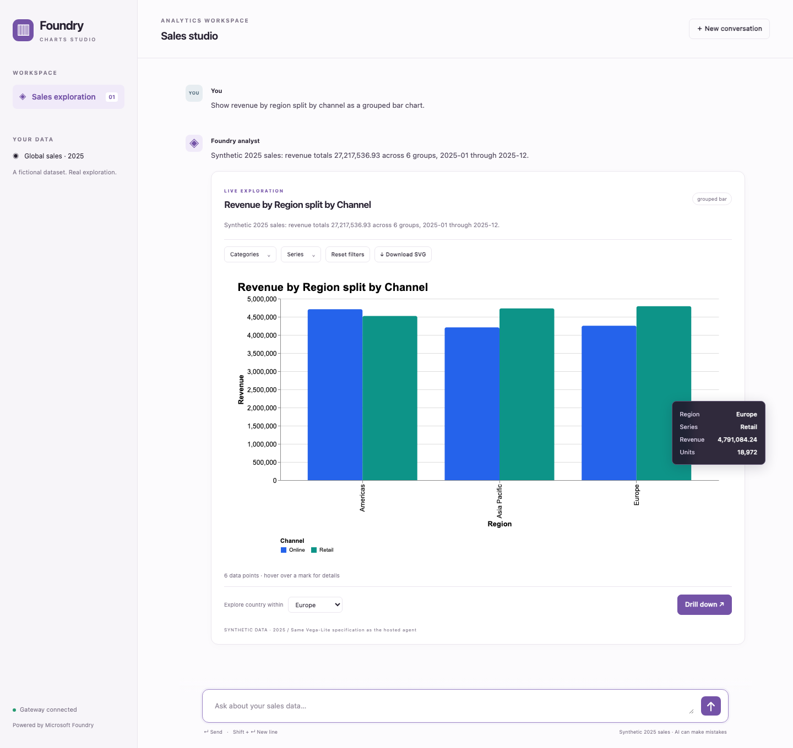
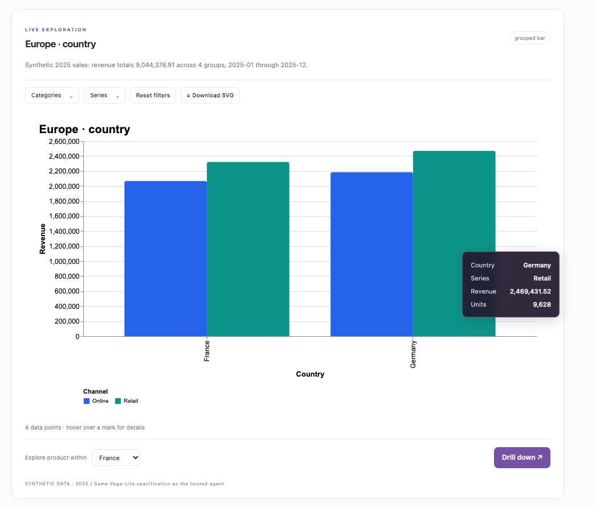
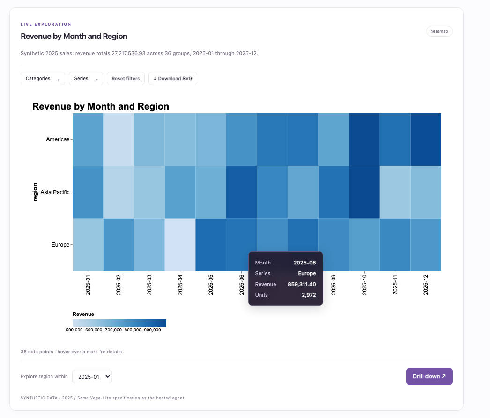
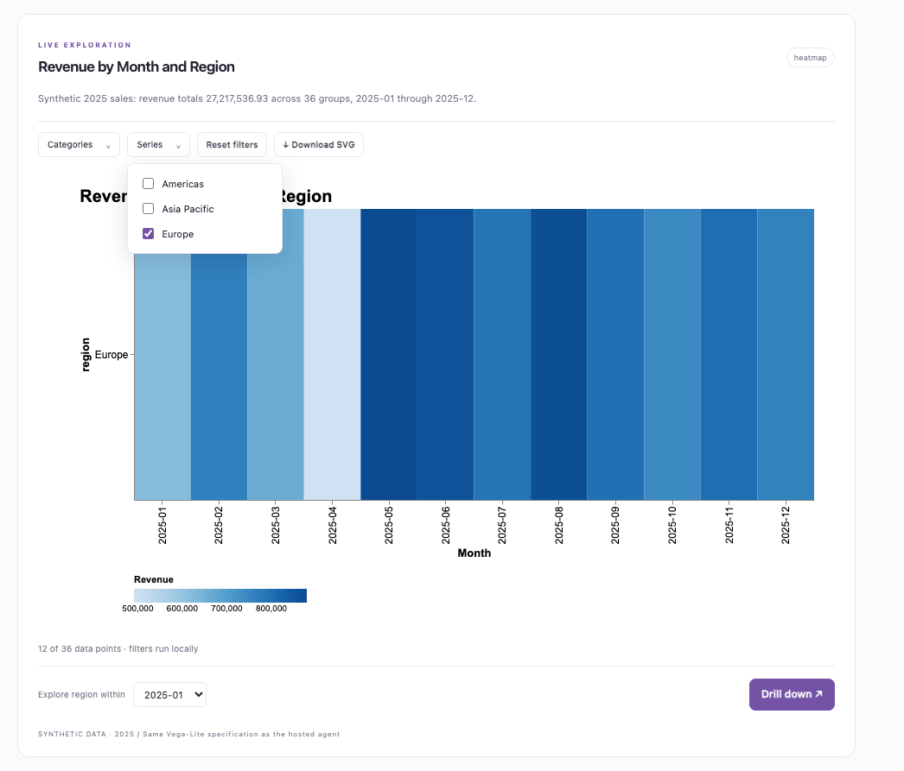

# Foundry Charts Agent

A Python **Microsoft Foundry Hosted Agent** that queries a deterministic, fictional sales database and renders the same chart differently for each caller. No Teams tab is used.

| Caller | Output |
|---|---|
| Responses API (default) | A PNG image link plus a downloadable SVG |
| Activity Protocol / M365 Agents Playground / Teams | Native Adaptive Card `Chart.*` controls when representable; otherwise a PNG image card |
| Custom web chat | Interactive SVG, hover details, local filters and server-side drill-down |
| MCP Apps host | The same interactive component, packaged as self-contained HTML and bound to an MCP tool |

The agent uses `FoundryChatClient` + Microsoft Agent Framework + a combined `ResponsesHostServer` / `ActivityAgentServerHost`, following [davrous/blenderagent](https://github.com/davrous/blenderagent). It does **not** create a competing prompt agent with the hosted agent's name. The project was scaffolded from Microsoft's [Responses local-tools sample](https://github.com/microsoft-foundry/foundry-samples/tree/main/samples/python/hosted-agents/agent-framework/responses/02-tools).

## Architecture

```text
                              Foundry Hosted Agent (Python)
Responses /responses ------> caller context + Agent Framework tools
Activity /api/messages ----->        |
                                    v
                             typed ChartRequest
                                    |
                             HTTP mock database API
                             (seeded SQLite, no model-generated SQL)
                                    |
                             aggregate ChartRow[]
                                    |
                             shared Vega-Lite specification
                              /                    \
                    vl-convert-python        native card mapper
                       SVG + PNG                 Chart.*
                              \                    /
                               protocol formatter

Custom chat ----> web/MCP gateway ----> local /responses OR Foundry agent_reference
MCP host -------> /mcp                    (not a second chart agent)
                     |
                ui://charts/app.html
                same SVG component as custom chat
```

The mock API is called through `httpx` even in local mode: an ASGI transport keeps the sample to two processes without replacing the API boundary with direct database access. Set `MOCK_API_URL` to move the mock service out of process. In development its endpoints are also inspectable under `/mock/schema` and `/mock/query`.

### Why Vega-Lite?

- One declarative grammar drives Python static rendering and browser SVG rendering.
- `vl-convert-python` produces PNG/SVG without a browser, Node server, or generated executable Python.
- The browser uses **Vega's expression interpreter**, not its default `new Function` expression compiler. This matters for the restrictive MCP Apps CSP, which does not allow `unsafe-eval`.
- Native Adaptive Cards do not accept Vega or SVG. They receive a separate, small mapping from the **same validated request and aggregate rows**.
- ECharts is an excellent alternative for highly bespoke charts, but its SVG server rendering adds a Node rendering runtime to this Python sample.

## Quick start

Prerequisites: **Python 3.13**, **Node.js 20.19+**, Azure CLI signed into the tenant of an existing Foundry project, and a deployed model supporting tool calling. This sample does not provision or deploy Azure resources during setup.

```bash
cp src/charts_agent/.env.example src/charts_agent/.env
# Edit the project endpoint and existing model deployment.
./chartagent setup
./chartagent dev
```

The local environment created for this workspace uses the requested existing project and `gpt-5.4-mini`. Its endpoint settings are in ignored `.env` / `.azure` files, not credentials in source.

In a second terminal:

```bash
./chartagent web
```

Open **http://localhost:8190**. The agent runs at **http://localhost:8088** by default.
To use another agent port, set `PORT` for both `dev` and `playground`, and set
`LOCAL_AGENT_URL` to the matching URL for `web`.

On Windows, use the equivalent `./chartagent.ps1 setup`, `dev`, `web`, `playground`, and `test` commands.

Try:

- "Show revenue by region as a bar chart."
- "Drill into Europe by country."
- "Monthly revenue split by region as a line chart."
- "Show a heatmap of revenue by month and region."
- "Scatter plot of units versus profit by product."
- "Show a donut of orders by channel."
- "Show revenue against a target of 1000000 as a gauge."

All figures are **synthetic 2025 data**. Unknown dimensions, values, metrics, invalid dates and unsupported query shapes fail validation rather than silently returning guessed data.

### Credentials

The native process uses `DefaultAzureCredential`, including the current Azure CLI login. Tokens and model credentials never go to the browser. If auth fails, sign into the correct tenant yourself and verify the configured deployment name; do not put tokens in prompts or source.

The optional container commands mirror the Blender launcher:

```bash
./chartagent rebuild
./chartagent start
# or ./chartagent up
```

Native development is the simplest keyless path. A plain local Python container has neither managed identity nor the host's Azure CLI; supply a supported developer credential explicitly if running it locally. In Foundry use the hosted identity. The launcher does not copy your Azure CLI token cache into an image.

### Responses API

```bash
curl http://localhost:8088/responses \
  -H 'Content-Type: application/json' \
  -d '{"input":"Show revenue by region","stream":false}'
```

The output contains Markdown image links, **not** a fabricated `output_image` response item. Both streaming and non-streaming Responses calls are supported. The hosted middleware emits chart payloads deterministically, rather than asking the model to reproduce URLs or serialized specifications.

Custom clients explicitly send `metadata.chart_output = "interactive"`. The gateway parses the resulting fenced `chart` payload into the shared `ChartBundle`. For deterministic drill-down, it sends a validated `ChartRequest` as the compact JSON string `metadata.chart_request`; the sample enforces the Responses metadata value limit of 512 characters. Larger selections should be redesigned as a server-side saved-query identifier, not silently truncated.

Caller metadata selects **presentation only**, never permissions.

#### Static output outside the Activity experience

For `"Show revenue by region as a bar chart."`, an ordinary Responses caller
receives the PNG below, even though this chart also has a native Adaptive Card
equivalent. The SVG download is a scalable artifact, not the interactive chat
component. The custom web/MCP clients explicitly opt into interactive output.



*Actual 960 x 540 PNG returned by the default Responses call. A copy is stored
with this README so the example does not depend on a running localhost server
or an expiring artifact URL.*

## Microsoft 365 Agents Playground

Install [Microsoft 365 Agents Playground](https://learn.microsoft.com/microsoft-365/agents-sdk/test-with-toolkit-project) and keep `./chartagent dev` running:

```bash
./chartagent playground
```

The script uses the Blender sample's `-e .../api/messages --service-url .../_connector` pattern. Both `/activity/messages` and `/api/messages` are handled by the official Activity host.

For a local container, the callback must be reachable from inside it:

```bash
PLAYGROUND_SERVICE_URL=http://host.docker.internal:56150/_connector ./chartagent playground
```

The endpoint is still `http://localhost:8088/api/messages`. Do not change the native-process callback to `host.docker.internal`. If using a nondefault Playground port, change **both** its `--port` and the callback port.

Use `/clear` to clear Activity conversation history. Chart cards include drill-down `Action.Submit` actions where the current grouping permits them. Typing activities keep longer requests alive; turns have a bounded timeout and report failures.

### Native chart and card-button drill-down

Ask **"Show revenue by region as a bar chart."** The Activity response uses a
native `Chart.VerticalBar`, an accessible data preview, and **Explore** buttons:



Choose **Explore Europe**. The card's `Action.Submit` sends a new query through
the agent and returns France and Germany, totaling **9,044,376.91**:



*Live local captures from Playground 0.2.27. The overview uses a 1280 x 980
desktop viewport at 2x pixel density; the detail is cropped for legibility.
Open any screenshot at full size to inspect its labels.*

### Adaptive Card support is host-specific

The mapper targets these eight Microsoft controls:

| Request kind | Adaptive Card type |
|---|---|
| `bar` | `Chart.VerticalBar` |
| `horizontal_bar` | `Chart.HorizontalBar` |
| `grouped_bar` | `Chart.VerticalBar.Grouped` |
| `stacked_bar` | `Chart.HorizontalBar.Stacked` |
| `line` | `Chart.Line` |
| `pie` | `Chart.Pie` |
| `donut` | `Chart.Donut` |
| `gauge` | `Chart.Gauge` |

Area, scatter and heatmap charts use static fallback. Additional semantic and sample payload-budget checks also trigger fallback rather than losing data. Each native chart has an element-level PNG `fallback` for renderers that do not recognize `Chart.*`.

**Adaptive Card v1.5 does not guarantee chart support.** The Microsoft chart controls are host extensions; generic card-schema validation alone cannot verify them. Playground may show the image fallback instead of a native chart, depending on its renderer. Verify final rendering in the intended Teams/Copilot client. This is deliberately not a claim that MCP Apps works over Activity.

#### Unsupported native chart: automatic image fallback

Ask **"Show a heatmap of revenue by month and region for all regions."** There is
no equivalent native Adaptive Card heatmap control, so the Activity response
contains an image card with the shared PNG and an explicit fallback explanation:



*The chart and explanation are shown here; the card also includes a data
preview below this crop. This PNG has no client-side hover or filters.
Compare it with the interactive rendering of the same heatmap below.*

## Web chat and MCP Apps

The gateway supports two independent upstream modes:

1. **Local:** forwards Responses calls to the local hosted process.
2. **Foundry:** invokes a deployed hosted agent through the project's Responses endpoint with an `agent_reference`. It does not attempt to expose arbitrary container HTTP paths through the Foundry gateway.

See [gateway configuration](gateway/.env.example) for the exact variables. For a deployed agent select Foundry mode, set the project endpoint and `FOUNDRY_AGENT_NAME` (and version if required). Run the gateway separately on a service suitable for public HTTP hosting; Foundry's protocol gateway is not a general-purpose web/MCP reverse proxy.

Connect an MCP Apps-capable client to **http://localhost:8190/mcp** for local testing. `get_chart` and `drill_chart` reference `ui://charts/app.html`; the resource is served with `text/html;profile=mcp-app` and resource-level CSP metadata. Hosts without Apps support still receive useful text/structured tool results.

The UI bundles its dependencies, uses SVG, and shares its rendering component between chat and the MCP widget. Local filters act on the returned aggregate rows without a model or API call; drill-down performs a new query through the hosted agent. Local filters therefore do not recover raw records that were never returned.

### Interactive SVG in the custom web chat

Ask **"Show revenue by region split by channel as a grouped bar chart."**
Hovering over a mark shows its region, channel, revenue and units. The same
component exposes filters, an SVG download, and a drill-down selector:



*Captured at 1440 x 1360 so the question, complete chart, tooltip and drill
controls remain visible together. The following screenshots focus on the chart
component, at approximately 1046 x 894 pixels.*

#### Drill-down queries new data

Select **Europe** under **Explore country within**, then choose **Drill down**.
The gateway calls the hosted agent again, retaining the channel breakdown and
filtering the new country query to Europe. The chart updates in place:



*Four returned groups: two countries, each split by two channels. Unlike local
filtering, this drill-down retrieves a new aggregation from the mock database.*

#### The heatmap stays interactive here

In a new conversation, ask **"Show a heatmap of revenue by month and region."**
Unlike the Activity image fallback above, the custom client renders all **36
cells as SVG marks**, with hover details:



#### Filter locally without another agent call

Open **Series** and deselect **Americas** and **Asia Pacific**, leaving **Europe**.
The status changes to **12 of 36 data points · filters run locally**:



*The capture walkthrough verified 36 to 12 visible cells with **zero network
requests** during filtering. Reset filters restores all returned rows. The
summary above the chart continues to describe the original query's full
dataset, not the currently visible subset.*

These are screenshots of the running **custom web chat**, not mockups or
Microsoft 365 Copilot captures. MCP Apps uses the same chart component; its
host chrome and feature availability depend on the MCP client.

### Copilot integration

[appPackage](appPackage/) contains a declarative-agent / MCP plugin starting point, not a Teams tab. Configure the externally reachable MCP URL and your registered authentication reference before packaging with Microsoft 365 Agents Toolkit. See that folder's guidance for schema and packaging details.

For production, the gateway requires validated Entra bearer tokens. Anonymous operation is an explicit **loopback development mode only**. A protected-resource challenge is not a complete OAuth authorization server: configure the Entra application, delegated scope, consent, and plugin OAuth/SSO registration. MCP Apps in Microsoft 365 Copilot is reached through the declarative agent/plugin path; it is **not** automatically enabled by publishing this hosted agent through Activity. Client availability can vary.

The included custom chat is a local development client, not a production sign-in
implementation. Before exposing it publicly, add a sign-in/BFF integration as
described in [gateway/README.md](gateway/README.md). The production gateway does
not bypass bearer-token validation to make an unauthenticated browser work.

## Deployment and storage

The [azure.yaml](azure.yaml) binds to the existing Foundry project, has no model deployments to provision, and declares Responses and Activity. Do not run provisioning just to test locally.

Before deployment:

1. Build and test the sample.
2. Use an existing **private Blob container** for chart artifacts; configure the hosted environment with `ARTIFACT_MODE=blob`, `CHARTS_DEV_MODE=false`, `AZURE_STORAGE_ACCOUNT_URL` and `AZURE_STORAGE_CONTAINER`.
3. Grant the hosted identity the required Blob write and user-delegation-key permissions (for example Storage Blob Data Contributor at storage-account scope).
4. Configure `FOUNDRY_PROJECT_ENDPOINT` and the existing `AZURE_AI_MODEL_DEPLOYMENT_NAME`.
5. Set the matching azd environment values before deploying (the service's `environmentVariables` forwards these settings):

   ```bash
   azd env set ARTIFACT_MODE blob
   azd env set CHARTS_DEV_MODE false
   azd env set AZURE_STORAGE_ACCOUNT_URL https://YOUR-ACCOUNT.blob.core.windows.net
   azd env set AZURE_STORAGE_CONTAINER charts
   ```

6. Deploy via your usual Foundry/azd workflow. Deployment and the authenticated remote MCP service are separate operations. The hosted process rejects development/local-artifact settings in a detected Foundry environment.

Blob images use read-only, HTTPS-only **user-delegation SAS** URLs with a default lifetime of 60 minutes. No storage account key or anonymous container is required. URLs will expire in old messages; storage retention/lifecycle rules and a refresh strategy are production decisions, not hidden guarantees in this sample. Set `ARTIFACT_TTL_MINUTES` within the documented sample range (1–1440). Local files persist under the ignored artifact directory and must be cleaned up when no longer needed.

In production local artifact mode fails closed. Localhost image URLs cannot be used by remote M365 clients. The source context also reports a Copilot image-display regression; this sample cannot fix client/platform regressions, so validate image fallback in the target tenant.

The Activity example uses bounded **in-memory conversation history**; Responses history uses the host's default storage. Neither is advertised as durable across container replacement. For real business data, add tenant/user authorization at the query layer, a durable scoped history store, audit/retention policies, quotas and gateway rate limits. Do not reuse demo format-selection metadata as an authorization mechanism.

## Development and verification

```bash
./chartagent test
src/charts_agent/.venv/bin/ruff check src gateway tests
npm --prefix web test
npm --prefix web run build
```

VS Code tasks launch the agent and gateway; F5 can launch the Python agent directly or attach with Foundry Agent Inspector. The debugger uses this sample's virtual environment, not a globally selected interpreter.

Automated tests exercise mock data/query validation, all chart kinds, SVG and PNG output, native-card shapes/fallbacks, Responses static/interactive/streaming formatting, caller isolation, Activity attachments, artifact persistence, and MCP/gateway contracts. They do not require a model call. Live local model and client checks are separate from tests; deployment and tenant-side Microsoft 365 acceptance still require your environment.

Live verification in this workspace used the existing `gpt-5.4-mini` deployment:
static Responses, streaming Responses, a follow-up Europe/country query, and
Playground native bar charts, card-button drill-down and heatmap PNG fallback
all completed successfully. Playground 0.2.27 rendered the native chart controls;
it also logged its own chart-layout warnings in a narrow viewport.

The custom chat rendered a 36-cell heatmap with accurate hover details. Filtering
to Europe reduced it to 12 cells with **zero network requests**. A real MCP client
initialized the gateway, discovered the chart tools, read the self-contained
widget resource with its MIME/CSP metadata, and successfully called `drill_chart`
through the hosted agent. The Python regression suite currently has **86 passing
tests**; the two warnings are upstream Starlette deprecations.

All **6 JavaScript tests** and both UI builds also pass. The test-only MCP host
harness verified the bundled widget under a restrictive CSP (including
`connect-src 'none'`, no `unsafe-eval`), including the SDK handshake, SVG, hover,
local filtering/reset and drill-down updates from the direct tool response.
It makes no CDN requests. To repeat that browser check:

```bash
npm --prefix web run test:mcp-host
# Open http://127.0.0.1:8192
```

This harness is excluded from production builds. It verifies the MCP Apps
contract, not tenant-side acceptance in Microsoft 365 Copilot.

## References

- [Blender agent architecture and launchers](https://github.com/davrous/blenderagent)
- [Microsoft chart controls](https://learn.microsoft.com/microsoftteams/platform/task-modules-and-cards/cards/charts-in-adaptive-cards)
- [Current Adaptive Cards chart reference](https://adaptivecards.microsoft.com/?topic=Chart.Donut)
- [MCP Apps specification](https://github.com/modelcontextprotocol/ext-apps/blob/main/specification/2026-01-26/apps.mdx)
- [MCP Apps in Microsoft 365 Copilot](https://learn.microsoft.com/microsoft-365/copilot/extensibility/plugin-mcp-apps)
- [Vega-Lite](https://vega.github.io/vega-lite/) and [vl-convert](https://github.com/vega/vl-convert)
