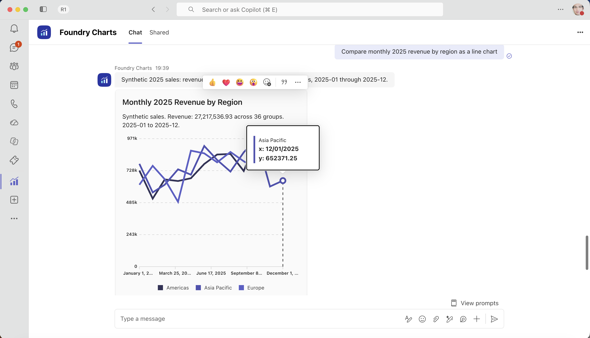
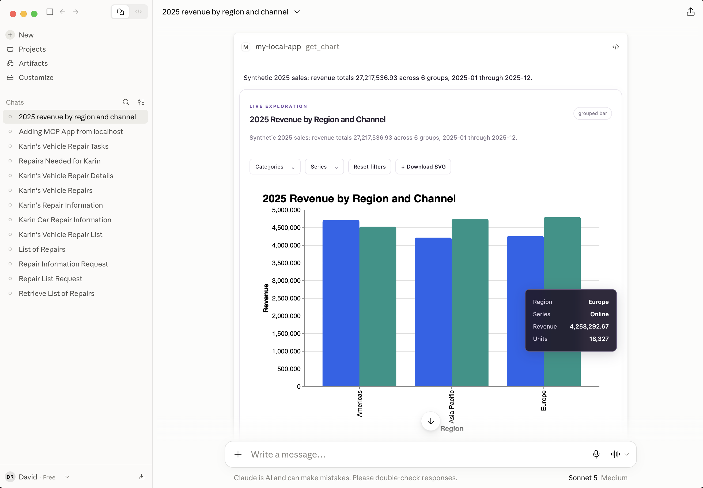
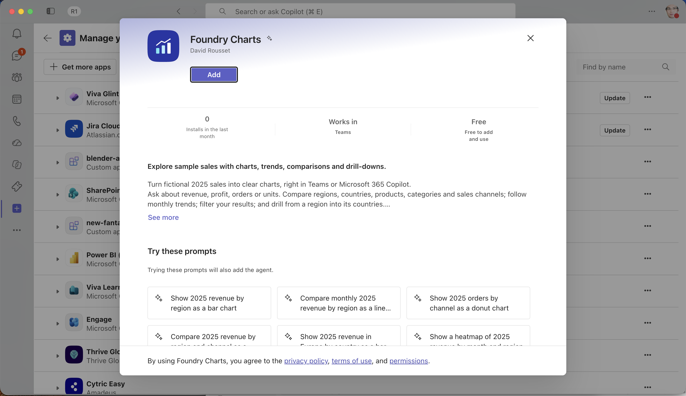

# Foundry Charts Agent

Build a **Python Microsoft Foundry hosted agent** that turns natural-language
questions into charts, lets users explore the underlying data, and delivers
the right experience for each client.

## Watch the demo: Foundry + M365: Beyond Static Charts

See the agent in action: static images through the Responses API, Adaptive Cards
in Teams and Microsoft 365 Copilot, and interactive SVG charts in the custom web
chat and in Microsoft 365 Copilot through a declarative agent with MCP Apps
integration. **Click the thumbnail below to watch on YouTube.**

[](https://youtu.be/i0YYFLNNSTM)

The sample queries a fictional sales database through a mock HTTP API. Users
can ask for an overview, compare metrics, and drill from regions into countries
or from categories into products. A shared chart result becomes a static image,
a native Adaptive Card, or an interactive SVG widget depending on the caller.

This is also a pattern for **other dynamic content**: keep data retrieval and
business logic in the agent, then adapt presentation to each protocol and host.
There is no Teams tab.

## What you can build

### One agent, multiple protocols and rendering levels

| Client | Connection | Experience |
|---|---|---|
| Responses API client | Foundry hosted agent, Responses protocol | Static PNG image link and downloadable SVG. This is the default output. |
| Teams, Microsoft 365 Copilot, or M365 Agents Playground | Foundry hosted agent, Activity Protocol | Native Adaptive Card charts when the chart can be represented; otherwise a PNG image card. Cards can include drill-down actions. |
| Custom web chat | Web gateway calling the agent's Responses API | Interactive SVG with hover details, client-side filters, SVG download, and drill-down queries. |
| MCP Apps-capable client | MCP gateway calling the same Responses API | The same interactive component embedded in the host conversation as an MCP App. |

The hosted agent exposes **Responses and Activity**. The optional gateway adds
web and MCP interfaces; it is an adapter, not a second charting agent.
Native chart controls and MCP Apps support depend on the client and its version.
The two Microsoft 365 integration paths are separate: an Activity app renders
cards/images, while an MCP App integration renders a custom widget in a
compatible host.

**In this guide:** [Experiences](#experiences) · [Architecture](#architecture) ·
[Run locally](#configure-and-run-locally) · [Deploy](#deploy-to-production) ·
[Extend the sample](#technical-guide-and-customization) · [References](#references)

## Experiences

All examples use **synthetic 2025 sales data**. Screenshots show the running
sample in the identified client; they do not require access to the original
deployment.

### Native charts in Teams and Microsoft 365

Ask **"Compare monthly 2025 revenue by region as a line chart."**
The Activity integration returns a native Adaptive Card chart rather than a
web page or custom tab.



*Teams connected to a Foundry-hosted agent. The chart is rendered by the
client's Adaptive Card controls, not the custom web renderer.*

Cards can also include **Explore** buttons. For example, a revenue-by-region
chart offers a country-level query for the selected region.

### Static output and automatic image fallback

An ordinary Responses caller receives a PNG and an SVG download for
**"Show revenue by region as a bar chart."** The SVG is a scalable artifact;
it is not the interactive chat widget.


The Activity integration also uses images when a chart has no suitable native
control. For **"Show a heatmap of revenue by month and region."**, it returns
an image card with a fallback explanation and data preview.


### Interactive exploration in the custom web chat

Ask **"Show revenue by region split by channel as a grouped bar chart."**
Hover over marks, select categories or series, download the SVG, and drill into
a region without leaving the conversation.


<details>
<summary>Explore drill-down, heatmaps, and local filtering</summary>

Select **Europe** under **Explore country within**, then choose **Drill down**.
The agent queries country-level data for Europe while retaining the channel
breakdown, and the chart updates in place.


The heatmap that uses an image fallback in Activity remains interactive in
the custom client, with SVG marks and hover details.


Use **Series** to keep only **Europe**. These filters operate on the rows
already returned to the client: they do not call the agent or query the API.
**Reset filters** restores the original selection.


Local filtering and drill-down are deliberately different. Filtering changes
the view of existing rows; drill-down retrieves a new aggregation. The summary
describes the original query, not a locally filtered subset.

</details>

### The same interactive component in an MCP App

An MCP Apps-capable client can display the shared widget directly in its chat.
The gateway exposes chart tools and a self-contained HTML resource; the host
connects tool results and subsequent drill-down calls to that resource.



*Shown in Claude Desktop. Host chrome, permissions, and widget availability
depend on the MCP client. See the [Copilot integration](#copilot-integration)
section for the Microsoft 365 deployment path.*

## Architecture

The Python agent uses **Microsoft Agent Framework** and `FoundryChatClient`.
A combined `ResponsesHostServer` / `ActivityAgentServerHost` serves the two
hosted protocols. Both paths share data access, validation, rendering and
artifact storage.

```text
Responses clients -----------------------------+
                                               |
Teams / M365 Copilot -- Activity / Azure Bot ---+--> Foundry hosted agent
                                               |      |
Custom web chat ---+                           |      +-- Caller context + tools
                   +--> Web / MCP gateway -----+      |
MCP Apps host -----+    (Responses upstream)           v
                                                 ChartRequest
                                                      |
                                               HTTP data API
                                            (mock seeded SQLite)
                                                      |
                                                 ChartRow[]
                                                      |
                                    +-----------------+-----------------+
                                    |                                   |
                             Vega-Lite spec                      Native card mapper
                             + static PNG/SVG                    or image fallback
                                    |                                   |
                                    +-----------------+-----------------+
                                                      |
                              ChartBundle (request, rows, spec, URLs, card)
                                                      |
                                         Protocol-specific formatting
                                          /                        \
                            Responses: image links           Activity: card
                            or interactive payload
                                      |
                             Web / MCP client renders SVG
                             (interactive payload only)
```

1. **Understand the request.** The agent discovers the data schema and
   produces a validated `ChartRequest`, rather than executable plotting code
   or model-generated SQL.
2. **Query the data.** The chart service calls an HTTP API for aggregate rows.
   The sample API owns a deterministic SQLite dataset.
3. **Build a shared result.** `ChartBundle` contains the request, rows, summary,
   Vega-Lite specification, image URLs and Adaptive Card representation.
4. **Adapt delivery.** Responses defaults to static links; Activity sends
   cards; the gateway requests interactive output for web and MCP clients.

The native card mapper consumes the same request and rows as Vega-Lite; it
does not attempt to embed SVG or Vega inside an Adaptive Card.

For local development, `httpx` uses an ASGI transport to call the mock API
in-process. This preserves the HTTP boundary without requiring a third
service. Set `MOCK_API_URL` to use a separately hosted API.

The gateway has two upstream modes: **local**, forwarding to the development
agent, and **foundry**, invoking a deployed hosted agent with an
`agent_reference`. The same frontend works with either.

## Configure and run locally

### Prerequisites

- **Python 3.13.** On macOS/Linux, `python3` should select that version.
- **Node.js 20.19+** and npm.
- **Azure CLI**, signed into the tenant containing your Foundry project.
- An existing **Foundry project and tool-calling model deployment**, with
  permission to invoke the model.
- Optional: [M365 Agents Playground](https://learn.microsoft.com/microsoft-365/agents-sdk/test-with-toolkit-project)
  for Activity testing, and an MCP Apps-capable client for the widget.

Local setup installs dependencies and builds the UIs. It does **not** provision
Azure resources or deploy the agent. Natural-language requests use your
configured model deployment and may incur model charges.

### 1. Get the code and configure the agent

```bash
git clone https://github.com/davrous/FoundryChartsAgent.git
cd FoundryChartsAgent
cp src/charts_agent/.env.example src/charts_agent/.env
```

Edit the copied `.env` with your own values:

| Setting | Local configuration |
|---|---|
| `FOUNDRY_PROJECT_ENDPOINT` | Your Foundry project endpoint. |
| `AZURE_AI_MODEL_DEPLOYMENT_NAME` | The name of your existing tool-calling model deployment. |
| `CHARTS_DEV_MODE` | Keep `true` for local development. |
| `ARTIFACT_MODE` | Keep `local` to save PNG/SVG files on your machine. |
| `ARTIFACT_BASE_URL` | Keep `http://localhost:8088/artifacts` when using the default port. |

Authentication uses `DefaultAzureCredential`, including your Azure CLI login.
No model key is required by this configuration, and Azure tokens are not sent
to the browser. Keep `.env` files and credentials out of source control.

### 2. Install dependencies and start the agent

From the repository root:

```bash
./chartagent setup
./chartagent dev
```

The setup command creates the Python environment at `src/charts_agent/.venv`,
installs the locked dependencies, and builds both web clients. Keep the agent
running at **http://localhost:8088**.

**Windows:** use `./chartagent.ps1 setup`, `./chartagent.ps1 dev`, and the same
PowerShell launcher for the remaining commands. It uses Python 3.13 through
the Windows Python launcher.

### 3. Open the custom web chat

In a second terminal:

```bash
./chartagent web
```

Open **http://localhost:8190**. The gateway defaults to the local agent; no
additional configuration is needed for the standard native setup.
Use [gateway/.env.example](gateway/.env.example) if you need different ports,
a deployed upstream, or gateway-specific settings.

Try these requests:

| Goal | Prompt |
|---|---|
| Overview | Show 2025 revenue by region as a bar chart. |
| Follow-up | Drill into Europe by country. |
| Trend | Compare monthly 2025 revenue by region as a line chart. |
| Distribution | Show 2025 orders by channel as a donut chart. |
| Complex visualization | Show a heatmap of 2025 revenue by month and region. |
| Relationship | Scatter plot of units versus profit by product. |
| Target | Show revenue against a target of 1000000 as a gauge. |

### 4. Try the Responses API

With the agent still running:

```bash
curl http://localhost:8088/responses \
  -H 'Content-Type: application/json' \
  -d '{"input":"Show 2025 revenue by region","stream":false}'
```

The response contains Markdown links to the PNG and SVG. Both streaming and
non-streaming Responses calls are supported. See
[protocol contracts](#protocol-contracts) to request interactive output from
your own client.

### 5. Try the Activity experience in M365 Agents Playground

With Playground installed and the agent running, open another terminal:

```bash
./chartagent playground
```

The launcher connects Playground to `http://localhost:8088/api/messages`
and configures its local connector callback. Ask for a revenue-by-region bar
chart, then select **Explore Europe** to issue a country-level query.


<details>
<summary>Country-level card returned by the drill-down action</summary>


</details>

Use **`/clear`** to reset Activity conversation history and cancel pending work
for that conversation. Both `/api/messages` and `/activity/messages` are
handled by the Activity host.

### 6. Connect an MCP Apps client

Keep the agent and gateway running. Connect an MCP Apps-capable client to
**http://127.0.0.1:8190/mcp**. The gateway exposes `get_chart` and `drill_chart`,
with the UI resource `ui://charts/app.html`.

For clients that need a local stdio bridge, follow the
[Claude Desktop setup guide](gateway/README.md#claude-desktop-local-mcp-app).
The bridge connects to the running gateway; it does not start either service.
An MCP host without Apps support receives text and structured tool results
instead of the embedded widget.

### Ports, debugging, and optional containers

- Set `PORT` consistently for `dev` and `playground` to change the agent port.
  Set `LOCAL_AGENT_URL` to the matching URL for the gateway, and update
  `ARTIFACT_BASE_URL` if you configured it explicitly.
- Set `GATEWAY_PORT` to change the web/MCP port.
- Use the supplied [VS Code tasks](.vscode/tasks.json) and
  [debug configurations](.vscode/launch.json) to run or debug the services.
  Select the service-local Python environment, not an unrelated root `.venv`.
- `./chartagent rebuild`, `start`, and `up` provide optional container
  workflows. A local container needs an explicit supported Azure credential;
  it does not inherit the host's Azure CLI login. Native development is the
  simplest keyless setup.
- For Playground with a local container, set
  `PLAYGROUND_SERVICE_URL=http://host.docker.internal:56150/_connector` so
  the agent can reach the callback.

## Deploy to production

Deploy the hosted agent first, then configure the client integration you need.
**Activity distribution and web/MCP gateway hosting are separate choices.**

| Component | Where it runs | When needed |
|---|---|---|
| Python agent | Microsoft Foundry hosted agents | All production experiences. |
| Chart artifacts | Private Azure Blob Storage | Images/downloads reachable by remote clients. |
| Activity integration and app package | Azure Bot registration plus Teams/M365 app | Native cards and image cards in Microsoft 365 clients. |
| Web/MCP gateway and built frontend | Separate authenticated HTTPS service | Custom web chat or MCP Apps. Not required for Activity. |

### 1. Deploy the hosted agent to Foundry

Follow the **[Foundry deployment runbook](docs/deployment.md)** for the complete
Azure Developer CLI (`azd`) commands, configuration and role-assignment steps.

1. Choose your existing Foundry project, tool-calling model deployment,
   storage account and private chart container.
2. Update `services.ai-project.endpoint` in [azure.yaml](azure.yaml) to **your
   project**. The checked-in endpoint is an example, not a shared service.
   Configure the matching endpoint, project ID and model in a separate
   production azd environment; do not reuse the local `.env` as deployment
   configuration.
3. Set `CHARTS_DEV_MODE=false`, `ARTIFACT_MODE=blob`,
   `AZURE_STORAGE_ACCOUNT_URL`, and `AZURE_STORAGE_CONTAINER`.
4. Validate and deploy the `charts-agent` service. The configuration uses a
   **Python 3.13 remote code build**; no local Docker or ACR build is required.
5. Read the deployed agent's **runtime identity**
   (`instance_identity.principal_id`). Grant **Storage Blob Data Contributor**
   on the chart container and **Storage Blob Delegator** on the storage account
   to that identity. It is created during the first deployment; do not
   substitute the project's managed identity.
6. Retrieve the active version and endpoints, then request a chart using a
   fresh session. Check the returned images and labels before connecting clients.

Only settings declared in `azure.yaml` under `environmentVariables` are
explicitly forwarded to the deployed application. Add any intended runtime
override there as well as in the production azd environment.

### 2. Publish the Activity app to Teams and Microsoft 365 Copilot

This path connects Microsoft 365 clients to the deployed agent's **Activity
Protocol** through an Azure Bot registration. It does not require the MCP gateway.

1. Follow the **Teams setup instructions generated by your deployment** for
   the bot and channel configuration.
2. Customize the [Activity app manifest](m365sideloadmanifest/manifest.json)
   for your app/bot IDs, publisher details, policy URLs and required image
   domains. Use your artifact host and any image-proxy hosts required by the
   target client. Do not copy another deployment's identity settings.
3. Follow the [sideload package guide](m365sideloadmanifest/README.md) to build
   the ZIP containing the manifest and its two icons.
4. Upload or distribute the package through your tenant's permitted app
   process. Custom-app policies and administrator approval apply.
5. Open the app in Teams or Copilot and request a native chart, a drill-down,
   and an image-fallback chart.



*Installing the app connects the client to the existing hosted agent; it does
not deploy another agent. The app description, icons and conversation starters
come from the manifest.*

### 3. Host the custom web chat or MCP gateway

Follow the [gateway hosting guide](gateway/README.md#hosting-distinction) and
[gateway infrastructure runbook](infra/gateway/README.md).

- Set `GATEWAY_MODE=foundry`, your `FOUNDRY_PROJECT_ENDPOINT`, and
  `FOUNDRY_AGENT_NAME`. Set `FOUNDRY_AGENT_VERSION` when pinning a version.
- Host the gateway and built web assets on a separate HTTPS service.
  Deploying the agent does not publish this repository's `/mcp` or web routes.
- Give the gateway's own managed identity the required project access.
  Configure Entra authentication for incoming requests and the approved
  origins for MCP widgets.
- A production custom web client also needs a sign-in/token-acquisition
  flow or backend-for-frontend. Do not expose the anonymous local demo publicly.

The MCP Server URL is the **deployed gateway's HTTPS origin plus `/mcp`**,
not the Foundry project endpoint or an image URL.

### Copilot integration

For a short-lived **development-only** test with a local agent, use the
[Foundry Charts DA Toolkit project](m365declarativeagent/README.md).
Its walkthrough runs `chartagent dev`, `chartagent web`, and
`devtunnel host -p 8190 -a` in separate terminals, then points the declarative
agent at the tunnel's `/mcp` endpoint. The `-a` tunnel permits anonymous public
access: use synthetic data only, monitor usage, and stop it after testing.
This is not the production authentication/deployment path.

To expose the interactive widget through MCP Apps in Microsoft 365 Copilot,
in production, follow the **[Copilot MCP App guide](docs/m365-copilot-mcp-app.md)**.
It covers the remote gateway, Entra/OAuth, host origins, plugin registration
and tenant-side installation.

The [MCP app package](appPackage/README.md) is a declarative-agent/MCP plugin
wrapper, separate from the Activity app package above. It reuses the deployed
Python agent. Check MCP Apps availability and the required permissions in
your target tenant; installing the Activity app does not install this widget.

## Technical guide and customization

### Repository map

| Area | Purpose |
|---|---|
| [agent.py](src/charts_agent/agent.py) | Agent instructions, tools, caller context and deterministic response formatting. |
| [contracts.py](src/charts_agent/contracts.py) | Validated query/chart requests, rows and the shared `ChartBundle`. |
| [mock_data.py](src/charts_agent/mock_data.py) | Seeded sales database and mock HTTP schema/query API. |
| [chart_service.py](src/charts_agent/chart_service.py) | Data access, rendering and artifact pipeline. |
| [rendering.py](src/charts_agent/rendering.py) | Vega-Lite specifications, PNG/SVG rendering, Adaptive Card mapping and fallbacks. |
| [artifact_storage.py](src/charts_agent/artifact_storage.py) | Local files or private Blob artifacts with signed URLs. |
| [main.py](src/charts_agent/main.py), [activity_bridge.py](src/charts_agent/activity_bridge.py), [activity_delivery.py](src/charts_agent/activity_delivery.py) | Hosting, Activity conversation state, progress and final delivery. |
| [gateway/](gateway/) | Web/MCP tools, upstream transport and gateway authentication. |
| [m365declarativeagent/](m365declarativeagent/) | Standalone Toolkit declarative agent, DA icons, and development-tunnel setup for Copilot MCP Apps. |
| [web/src/](web/src/) | Shared interactive chart component, web chat and MCP App entry points. |
| [tests/](tests/), [web/test/](web/test/) | Backend, protocol and frontend tests. |

### Replace the mock data or add new content

The sample supports revenue, profit, units and orders, grouped or filtered by
month, region, country, category, product and channel. Unknown dimensions,
values and unsupported query shapes fail validation rather than returning
guessed data.

To connect your own backend:

1. Replace the schema/query implementation in `mock_data.py`, or point
   `MOCK_API_URL` at a service implementing the same `/schema` and `/query`
   contract. Local artifact mode also exposes the sample endpoints under `/mock`.
2. Update the validated contracts and agent instructions for your domain.
   Keep query validation and authorization at the data boundary.
3. Preserve aggregate rows as the shared input to renderers and drill-down.
   Add tests for valid queries, rejected inputs and empty results.

To add a visualization, extend the chart contract, Vega-Lite builder and
interactive controls as needed. Add a native-card mapping only when a host
control preserves its meaning; otherwise keep the image fallback.

For other dynamic content, reuse the same separation: **typed result ->
static representation / card / interactive resource -> protocol formatter**.
For example, a report or diagram can have an image fallback and a richer
web/MCP view without duplicating its data-retrieval logic.

### Protocol contracts

- **Responses:** static output contains Markdown PNG/SVG links, not a custom
  `output_image` response item. Middleware formats artifacts deterministically;
  the model is not responsible for reproducing URLs or serialized chart data.
- **Interactive Responses:** set `metadata.chart_output` to `"interactive"`.
  The gateway parses the returned fenced `chart` payload as a `ChartBundle`.
  For deterministic drill-down, `metadata.chart_request` contains a validated
  `ChartRequest` serialized as a compact JSON string. It must fit the
  **512-character metadata value limit**; larger selections need a different
  contract, such as a server-side saved-query identifier.
- **Activity:** sends a summary and Adaptive Card attachments. Card
  `Action.Submit` actions request another aggregation through the agent.
- **MCP Apps:** `get_chart` and `drill_chart` reference `ui://charts/app.html`,
  served as `text/html;profile=mcp-app` with resource-level CSP metadata.
  The widget uses the host's tool-call channel for drill-down.

Caller metadata chooses **presentation, not permissions**. Never use an
output-format flag as an authorization decision.

### Why Vega-Lite?

- The same declarative specification drives Python static rendering and
  browser SVG rendering.
- `vl-convert-python` produces PNG/SVG without a browser or Node rendering
  server in the hosted agent.
- The shared web component supports hover details and updates the returned
  dataset for local filtering, without another agent call.
- The MCP widget bundles its dependencies and uses **Vega's expression
  interpreter**, avoiding CDNs and `unsafe-eval` in restrictive host sandboxes.
- The generic `sans-serif` font works across browser and minimal hosted
  environments; avoid relying on desktop fonts being installed on the server.

### Adaptive Card support is host-specific

| Request kind | Native control |
|---|---|
| `bar` | `Chart.VerticalBar` |
| `horizontal_bar` | `Chart.HorizontalBar` |
| `grouped_bar` | `Chart.VerticalBar.Grouped` |
| `stacked_bar` | `Chart.HorizontalBar.Stacked` |
| `line` | `Chart.Line` |
| `pie` | `Chart.Pie` |
| `donut` | `Chart.Donut` |
| `gauge` | `Chart.Gauge` |

Area, scatter and heatmap requests use images in Activity. Semantic checks
and payload budgets can also select image fallback to avoid dropping data.
Native chart elements include a PNG `fallback` for renderers that do not
recognize the control.

`Chart.*` controls are host extensions: **Adaptive Card schema version 1.5
alone does not establish chart support**. Check the intended client, including
its fallback and card-action behavior.

### Live progress and long-running chart delivery

The Activity adapter reports real stages: schema discovery, querying,
rendering and artifact preparation. It uses SDK streaming where supported
and ordinary progress messages otherwise. Summary and chart attachments
share one final outgoing Activity.

By default, work that exceeds **35 seconds** hands off to background delivery
through a fresh authenticated connector. Keepalives run every **15 seconds**;
the overall work deadline is **100 seconds**. Buffered `expectReplies` clients
keep an inline result instead. See the [environment example](src/charts_agent/.env.example)
for the timing settings.

Turns serialize within a conversation; `/clear` cancels pending work and resets
its history. The sample's background jobs and Activity history are **in-process**.
For multi-replica or restart-safe operation, add durable jobs/history,
conversation coordination and delivery deduplication.

### Storage, identity, and production hardening

- Production artifacts use private Blob Storage with **read-only, HTTPS-only
  user-delegation SAS** URLs. No account key or anonymous container is required.
  The default URL lifetime is 60 minutes; plan for expiry in older messages,
  artifact retention and cleanup. Do not log or publish signed URLs.
- `ARTIFACT_TTL_MINUTES` supports 1-1440 minutes. Hosted overrides require
  forwarding in `azure.yaml`; local `.env` values do not configure deployment.
- Local artifact files persist until cleaned up. Foundry hosting rejects
  development/local-artifact configuration; remote clients cannot use
  localhost image URLs.
- Gateway-to-Foundry authentication and user-to-gateway authentication are
  separate. For real data, enforce tenant/user access at the query layer,
  rather than relying on the gateway's service identity alone.
- Add durable scoped conversation state, quotas, rate limits, audit/retention
  policies and an appropriate network design before serving private business data.

### Development and verification

Run from the repository root after setup:

```bash
./chartagent test
src/charts_agent/.venv/bin/ruff check src gateway tests
npm --prefix web test
npm --prefix web run build
```

On Windows, use `./chartagent.ps1 test` and the tools under
`src/charts_agent/.venv/Scripts/`. The Python launcher accepts pytest selectors.
Automated tests cover data/query validation, chart formats and fallbacks,
protocol formatting, Activity delivery, storage and gateway contracts without
requiring live model calls.

For browser work, start the agent and gateway, then run the
[local MCP host harness](web/test/README.md):

```bash
npm --prefix web run test:mcp-host
# Open http://127.0.0.1:8192
```

The harness exercises the bundled widget in a restrictive iframe sandbox and
is excluded from production builds. Test the installed experience in each
intended client separately from unit tests.

### Optional evaluation suite

[eval.yaml](src/charts_agent/eval.yaml) provides an optional evaluation
configuration for request adherence, data grounding and caller-appropriate
output. Review its model/project settings and referenced datasets/evaluators
before running it in your environment. Generated candidate responses are not
ground truth; evaluation execution is separate from deployment and can incur
model charges.

## References

- [Microsoft Foundry hosted agents](https://learn.microsoft.com/azure/foundry/agents/concepts/hosted-agents)
- [Microsoft Foundry Agent Framework Responses/local-tools sample](https://github.com/microsoft-foundry/foundry-samples/tree/main/samples/python/hosted-agents/agent-framework/responses/02-tools), the starting point for this project's hosted-agent scaffold.
- [Microsoft 365 Agents Playground](https://learn.microsoft.com/microsoft-365/agents-sdk/test-with-toolkit-project)
- [Charts in Adaptive Cards](https://learn.microsoft.com/microsoftteams/platform/task-modules-and-cards/cards/charts-in-adaptive-cards) and [chart control reference](https://adaptivecards.microsoft.com/?topic=Chart.Donut)
- [MCP Apps specification](https://github.com/modelcontextprotocol/ext-apps/blob/main/specification/2026-01-26/apps.mdx)
- [MCP Apps in Microsoft 365 Copilot](https://learn.microsoft.com/microsoft-365/copilot/extensibility/plugin-mcp-apps)
- [Vega-Lite](https://vega.github.io/vega-lite/) and [vl-convert](https://github.com/vega/vl-convert)
- [Blender hosted-agent sample](https://github.com/davrous/blenderagent), architectural inspiration for protocol-aware delivery and the development launchers.
